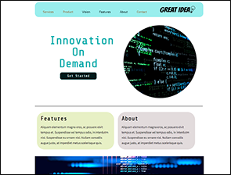
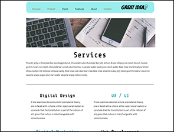
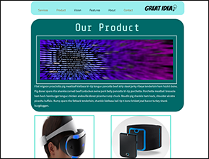

# Project Details

<b>Objectives:</b> 
 Student should be able to describe and understand that flexbox is a module, demonstrate understanding of flex container properties in flex box and demonstrate understanding of flex item properties in flexbox.

*Completed all Minimal Viable Project Tasks*

<strong>Stretch Tasks:</strong> 
- Created another page based on one of the navigation items in addition to services. 

  

# Project Links

<a href="http://jasheletillman.me/User-Interface-Services-Page-Project/" target=_blank>See this project live?</a>  

<a href="http://jasheletillman.me/User-Interface-Services-Page-Project/services.html" target=_blank>Services Page</a>

<a href="http://jasheletillman.me/User-Interface-Services-Page-Project/product.html" target=_blank>Product Page</a>

<a href="http://jasheletillman.me/User-Interface-Services-Page-Project/contact.html" target=_blank>Contact Page</a>

# Contact Me
<a href="https://www.linkedin.com/in/jashelet/" target=_blank>LinkedIn</a> • <a href="https://twitter.com/jasheloper" target=_blank>Twitter</a> • <a href="https://www.instagram.com/jasheloper/" target=_blank>Instagram</a> • <a href="mailto:jftjashele@gmail.com" target=_blank>E-mail</a> 
  

# User Interface Project II: Great Idea Web Page With Flexbox

Now that you have experienced building a layout using `inline-block`.  Lets revisit the same HTML structure and refactor our first page with flex box module.  If you didn't finish yesterday's assignment, just start from scratch or use the solution code provided to you.

Once you have finished the home page using flex box module, go build the services page based on the [design file](design-files/services-desktop-design.png) provided to you.  This time you will need to structure your own HTML in addition to using flex box module.  You have been provided all the necessary images in the `img` folder.

**Useful Resource: [CSS Tricks Flexbox Guide](https://css-tricks.com/snippets/css/a-guide-to-flexbox/)**

## To Get Started

* Fork the project to your GitHub account
* Clone this project into a directory on your machine.
* Open the code with your preferred integrated development environment (IDE).
* Start on the objectives

[Click this link to learn how to use git on this project](https://youtu.be/8UQYTQzzNYM)  

## Objectives

* [ ] Home Page Refactor:
  * Note that the provided HTML is blank.  This is because I want you to use your code from yesterday if possible.  If you didn't finish, that's fine, just use the solution from yesterday
  * Refactor the home page layout with flexbox where `inline-block` was used before.
  * In your navigation elements, point the services `` to `services.html`

* [ ] Services Page Build:
  * Update the title in your newly copied services page to say `Great Idea! - Services`
  * Using the provided [design file](design-files/services-desktop-design.png), create the services page layout using flexbox and box model.
  * Wrap the great idea logo in an anchor tag and point the `href` to `index.html`
  
  **Remember, you should continue using box model properties this whole time.  Flexbox is only used for bigger layout pieces.  You will still need content width, padding, border, and margins to succeed.**

## Stretch Goals

* [ ] Create another page based on one of the navigation items in addition to services.  Try to create a layout that follows the patterns of the first two designs but with your own creative twist.  Use lorem ipsum text for all your content.
* [ ] Introduce media queries into your services page to create a mobile view that stacks all the boxes on top of each other on phone but looks like the layout file on desktop.
